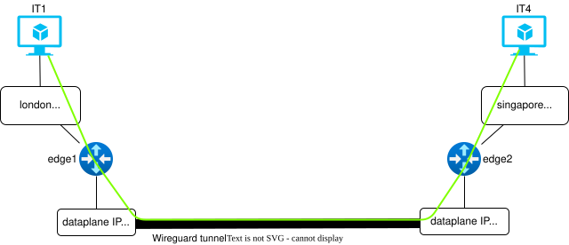
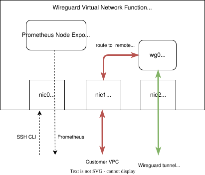
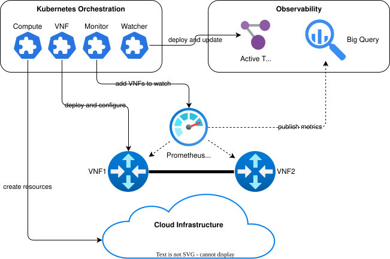

# Network Agent Demonstration

The Network Agent is an interactive AI service that helps Cloud Architects easily create and manage Enterprise connectivity services. The network agent demo shows the following:

* Cloud native orchestration of an Enterprise connectivity service, deploying a set of virtual routers on GCP to connect IT applications across locations.
* Natural language chat interface to discover, design and update Enterprise connectivity services.

The main components of the demo can be seen in the figure above. 

* __Chat Interface__: Multi modal chat interface to allow Cloud architects to use natural language and images to manage their network services
* __Network Agent__: GenAI agent that can run a set of tools to report on and make changes to a customers network services
* __Cloud Native Service Orchestration__: Kubernetes based orchestration of cloud, connectivity service and virtual network function resources
* __Service Monitoring__: Collection of virtual network function metrics for performance and fault monitoring. 

## Network Agent Use Cases

The Network Agent provides a natural language interface to allow an Enterprise customer to create, update and view their multi cloud connectivity services. Simplifying the experience of designing and maintaining complex connectivity services. 

The network agent support the following use cases:

* Ask for a description of available connectivity services that can be deployed
* Request a new instance of a connectivity service. Interacting with the Agent to provide the required information to instantiate the chosen service. Confirm all connectivity design decisions and confirm the 
* Update an existing instance of a connectivity service. Interacting with the Agent to ensure all required information is collected and confirming the exection of agreed changes
* View existing services and their configuration
* View monitoring statistics for one or more connectivity services

## Network Services

The demo supports the deployment of virtual network functions in a number of service topologies, e.g. 

* __Site to site__: connecting 2 sites together with a VPN tunnel
* __Mesh__: connecting 3 or more sites in a full mesh
* __Muti hop__: connecting 2 or more sites across a series of locations

The Network Agent is trained on the information needed to deploy each of these servies and also how to monitor their performance from the metrics captured. The sections below describe the network services and virtual network function in more detail.

### Site to Site

This service connects two private VPCs over a wireguard tunnel. A pair of virtual network functions (VNFs) are connected to the two provided private VPCs. A wireguard tunnel is configured between the VNFs and static routes added to the private VPCs to route traffic over the VPN tunnel.

### Mesh (To be done)

https://www.zenarmor.com/docs/network-security-tutorials/how-to-configure-wireguard-mesh-vpn

### Multi Hop (To be done)

https://www.procustodibus.com/blog/2022/06/multi-hop-wireguard/

## Wireguard Virtual Network Function

The virtual network function used in this demo is based on opensource linux software, i.e. ubuntu, wireguard, iptables etc. In later iterations of the demo, 3rd party virtual firewalls/VPN software will be added.

As seen in the diagram above, the VNF is configured with 3 network interfaces

* __Mgmt__: All communication with the VNF for configuration and monitoring is carried over this interface. 
* __Customer VPC__: The pre-existing customer VPC to connect the VNF to and route traffic to/from
* __Dataplane__: The VPC dedicated to carrying the VPC traffic, connecting a collection of VNFs

A wireguard virtual network interface is created, connecting pairs of VNFs over the dataplane network. All allowed traffic from each VNF is routed between the customer network interface and the wireguard virtual interface. 

## Lifecycle Management Architecture

The diagram below depicts the main components responsible for lifecycle management of the demo connectivity services. 

Cloud network/compute resources, VNFs, observability virtual machines and cloud services are created and configured with a set of Kubernetes custom resource operators. See the sections below for more details. 

### K8s Custom Resources 

#### Cloud CRDs

#### Service and Resource CRDs

#### Observability CRDs

### CICD

To be done

## Network Agent Architecture

To be done

## GCP Environment

A single GCP environment is used to deploy the entire demo environment, orchestrating the customer environment and the connectivity services into an operational state. 

The figure above shows a GCP environment for a simple site to site service connecting IT applications across 4 private VPC locations. 

The demo environment orcestrates the following components into plane:

* __Customer VPCs__: The customer brings their own VPCs
* __Mgmt and dataplane VPCs__: A management VPC carries all orchestration and monitoring metrics, and a dataplane VPC carries all VPN traffic. 
* __Prometheus Server__: A prometheus server is deployed on the management network and runs queries against Edge appliance node exporters. 
* __Wireguard Edge Appliances__: VPN virtual appliances are deployed and connected to customer and dataplane networks to create one or more tunnels.

## Create the demo environment

To build the demo environment, do the following:

* [Setup base GCP environment](environment/Readme.md)
* [Setup Prometheus](docs/monitor.md)
* [Build and deploy the network operator](/operator/Readme.md)
* [Build and deploy the network tools REST endpoint](/tools/Readme.md)
* [Build and deploy the network agent](/networkagent/Readme.md)

