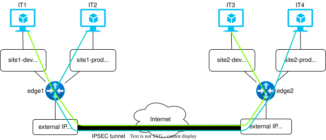
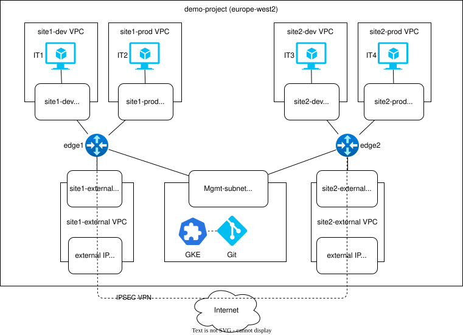

# Network Agent Demonstration

The Network Agent is an interactive AI service that helps Cloud Architects easily create and manage Enterprise connectivity services. The network agent demo shows the following:

* Cloud native orchestration of an Enterprise connectivity service, deploying a set of virtual routers on GCP to connect IT applications across locations.
* Natural language chat interface to discover, design and update Enterprise connectivity services.

The main components of the demo can be seen in the figure above. 

* __Chat Interface__: Multi modal chat interface to allow Cloud architects to use natural language and images to manage their network services
* __Network Agent__: GenAI based agent that can run a set of tools to report and action changes on the network services
* __Cloud Native Service Orchestration__: Kubernetes based orchestration of cloud and virtual network resources
* __Service Monitoring__: Collection of edge appliance metrics for performance and fault monitoring. 

## Network Agent Use Cases

The Network Agent provides a natural language interface to allow an Enterprise to create, update and view their multi cloud connectivity services. Simplifying the experience of designing and maintaining multi cloud connectivity services. 

The network agent support the following use cases:

* Ask for a description of available connectivity services that can be deployed
* Request a new instance of a connectivity service. Interacting with the Agent to provide the required information to instantiate the chosen service. Confirm all connectivity design decisions and confirm the 
* Update an existing instance of a connectivity service. Interacting with the Agent to ensure all required information is collected and confirming the exection of agreed changes
* View existing services and their configuration
* Request a monitoring service to be deployed for one or more connectivity services
* View monitoring statistics for one or more connectivity services

## Network Services

The demo supports edge appliance to be deployed in a number of service topologies, i.e. 

* __Site to site__: connecting 2 sites together with a VPN tunnel
* __Mesh__: connecting 3 or more sites in a full mesg
* __Muti hop__: connecting 2 or more sites across a series of edge gateways

The Network Agent is trained on the information needed to deploy each of these servies and also how to monitor their performance from the metrics captured. The sections below describe these network service in more detail.

Note: Initially the network software used is based on opensource linux software, e.g. wireguard, iptables etc. In later iterations of the demo, 3rd party virtual firewalls/VPN will be "plugged" into the demo. 

### Site to Site

This service connects private VPCs over a wireguard tunnel. A pair of virtual edge appliances are connected to a the private VPCs and to the Internet. A wireguard tunnel is configured between the edge appliances and static routes updated in the VPCs to route private traffic over the VPN tunnel.

### Mesh (TBD)

https://www.zenarmor.com/docs/network-security-tutorials/how-to-configure-wireguard-mesh-vpn

### Multi Hop

https://www.procustodibus.com/blog/2022/06/multi-hop-wireguard/

## GCP Environment

A single GCP environment is used to demonstrate the orchestration of all the Cloud moving parts from scratch needed to bring the connectivity service into an operational state. 

The figure above shows a GCP environment for a simple site to site service connecting IT applications across 4 private VPC locations. 

Each demo environment will have the following:

* __Customer VPCs__: The customer brings their own VPCs
* __Mgmt VPC__: A management VPC with all orchestration and monitoring tools deployed. 
* __Edge Appliance VPCs__: The VPCs created to host the edge virtual network appliances. 

## Create the demo environment

To build the demo environment, do the following:

* [Setup base GCP environment](environment/Readme.md)
* [Setup Prometheus](docs/monitor.md)
* [Build and deploy the network operator](/operator/Readme.md)
* [Build and deploy the network tools REST endpoint](/tools/Readme.md)
* [Build and deploy the network agent](/networkagent/Readme.md)

