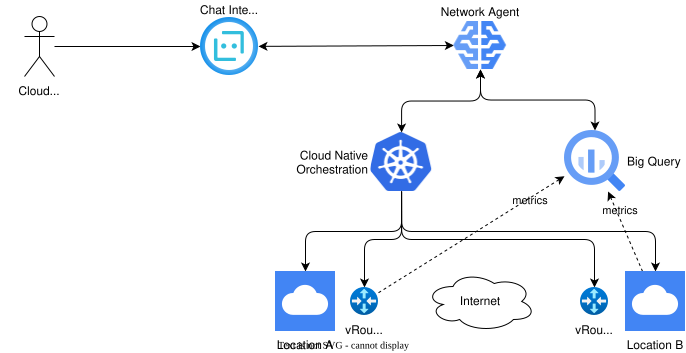
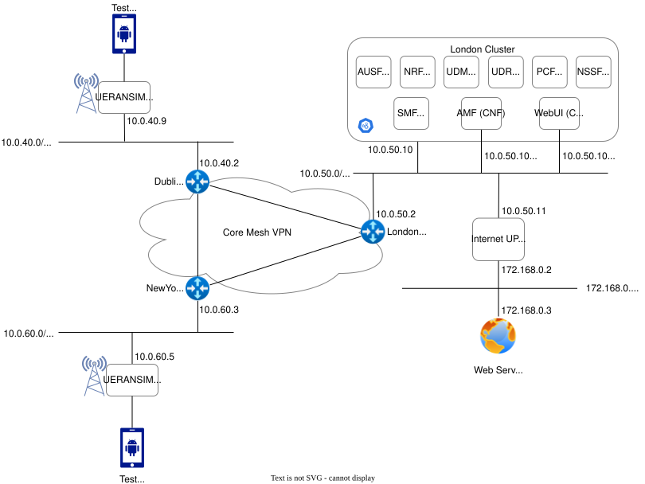

# Network Agent Demonstration

The Network Agent is an interactive AI service that helps Cloud Architects easily deploy and manage mobile network infrastructure and software. The network agent demo shows the following:

* Cloud native orchestration of a complete mobile network service.  
* Natural language interface to run simulated UE tests and analyse performance data.

The main components of the demo can be seen in the figure above. 

* __Chat Interface__: Multi modal chat interface to allow Cloud architects to use natural language and images to manage their network services
* __Network Agent__: GenAI agent that can run a set of tools to report on and make changes to a customers network services
* __Cloud Native Service Orchestration__: Kubernetes based orchestration of cloud, connectivity service and virtual network function resources
* __Active Topology__: Listen for infrastructure and softweare lifecycle changes in GKE and update a topology graph with the current state of the network. 
* __Service Monitoring__: Collection of virtual network function metrics for performance and fault monitoring. 

The virtual mobile network topology shown below is automated into an operational state in a single GCP project.  

The following virtual infrastructure is deployed to instantiate the network service. 

* __Core Network Site:__ Running 5G Core network functions
    * VPC Network
    * K8s Cluster to run 
    * Free5gc Control Plane VNFs
    * Free5gc UPF VNF
* __Radio Sites:__ Running Radio simulators
    * VPC Network
    * UERANSIM gNB Radio Network Simulator VNF
* __Mesh VPN:__ Connecting all sites
    * Wireguard VNFs created a set of tunnels in a mesh between all sites.

Once deployed test traffic can be run from the simulated UEs across the network to the Internet. 

## Architecture

The following links detail the main aspects of the network agent demo.

* [Network Services](docs/networkservices.md)
* [Virtual Network Functions](docs/wireguard-vnf.md)
* [GCP Environment](docs/gcp.md)
* [Lifecycle Management](docs/lifecycle.md)
* [GitOps of Network Services](docs/cicd.md)
* [Network Agent](docs/agent.md)

## Create the demo environment

Following the steps below to create a network agent demo environment.

* [Setup GCP environment](environment/Readme.md)
* [Build and deploy the network operator](/operator/Readme.md)
* [Build and deploy the network agent REST tools](/tools/Readme.md)
* [Build and deploy the network agent](/networkagent/Readme.md)
* [Log into GitOps environment](/docs/git.md)

## Demo Scenario

* [Deploy free5gc network](docs/demo.md)

# LICENSES

The source code of this project is provided under the [Apache 2.0 license](LICENSE). All other artifacts such as images, video, audio and data as free/open material is provided under the [CC-BY 4.0 license](http://creativecommons.org/licenses/by/4.0/).