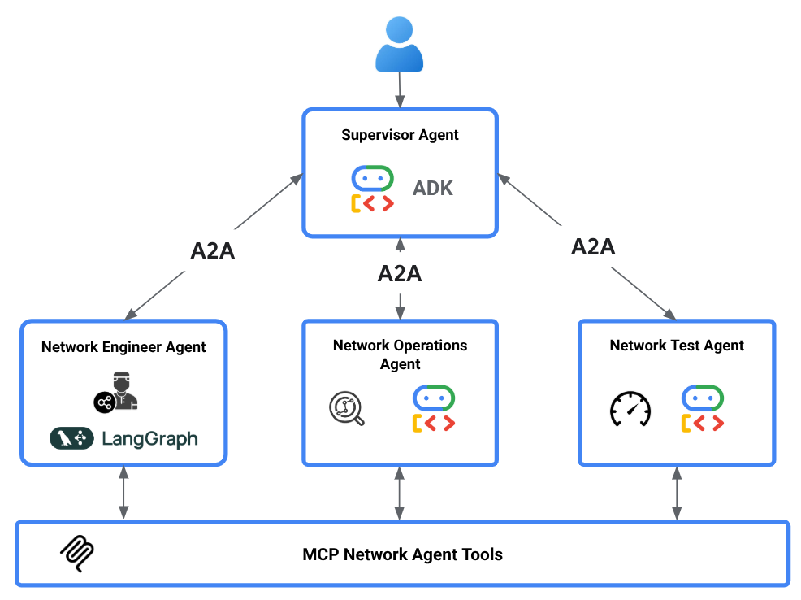
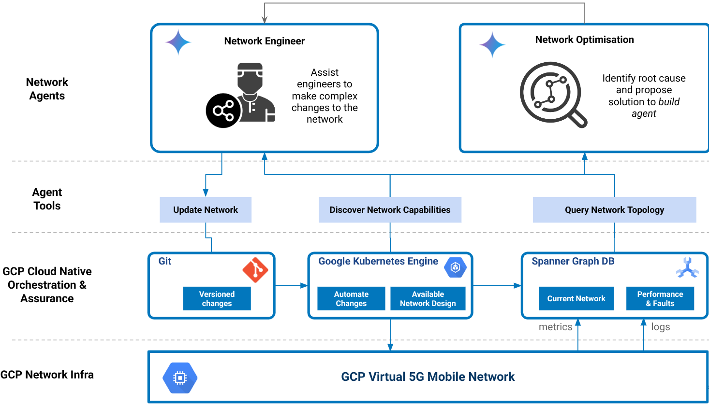

# Network Agent Demonstration

This repository demonstrates a set of network agents that manage the end to end lifecycle of a virtual telecoms network. The agents are built on [Google's Autonomous Network Operations Framework](https://cloud.google.com/blog/topics/telecommunications/the-autonomous-network-operations-framework-for-csps?e=48754805?utm_source%3Dlinkedin) and implemented using Google's [agent development kit](https://google.github.io/adk-docs/) and [agent to agent protocol](https://a2aprotocol.ai/). The agents are designed to help Network Architects and Operators easily deploy and manage complex Telco infrastructure and network function software.

## Unified assurance platform development

The `unified-platform` branch is progressively combining this lifecycle platform
with the deterministic LTE assurance demo. P2a now provides a cloud-independent
Local Profile for safe CSV/DuckDB ingestion, anomaly preview, explicit Incident
confirmation, and read-only rule-based RCA. It does not require GCP, ADK, a
model API, or network access.

The Local Profile now also has a single repository entry point for deployment
checks, initialization, status, a deterministic governance demo, an optional
foreground loopback service, and marker-scoped reset:

```text
python tools/local-stack/local_stack.py --workspace .local/networkagent-stack doctor
python tools/local-stack/local_stack.py --workspace .local/networkagent-stack init
python tools/local-stack/local_stack.py --workspace .local/networkagent-stack demo --confirm-incident
```

The demo stops at `AWAITING_APPROVAL`. A second command may enable
`--action-mode simulate` and approve only the exact `action_hash` and Incident
revision returned by that preview. The sole action is `LOCAL_SIMULATION`;
successful verification reaches `RESOLVED`, while failed verification reaches
`REOPENED`. This path never calls GCP, Engineer, MCP, GitOps, or a Network
Operator and cannot perform a real network change.

The foreground Assurance process also exposes a strict loopback-only
Governance HTTP surface under `/local/v1/incidents/{incident_id}` for reading,
preparing, deciding, and executing the same local simulation lifecycle. POST
operations require an explicit `governance-v1` operation header and strict JSON;
the existing A2A JSON-RPC and Agent Card routes remain unchanged. A separate
`POST /local/v1/faults/replay` route accepts only the public, versioned
`ReplayWirePayload` contract from a loopback peer. It acknowledges with HTTP
202 only after bounded readback verifies the current Incident's immutable
facts, its initial revision-0 Audit, and its source-event association. Neither
local route can invoke a real network action.

The same direct-loopback surface exposes `GET /local/v1/healthz`, `readyz`,
and `version`. Liveness does not read a repository; readiness performs one
bounded Canonical repository read and returns a fixed 503 for dependency
failure, timeout, or a still-running timed-out worker; version returns only
allowlisted package and contract versions. All standard non-GET methods use the
same bounded JSON 405 contract; HEAD keeps the normal empty-body semantics.
These unsigned local probes do not attest Cloud readiness or deployment
identity.

The direct h11 ingress admits at most 32 live transports and applies a
one-second header deadline. Governance, Fault, and A2A share one request-body
slot with zero queue and a two-second body deadline; Governance/Fault also
share one isolated business worker with zero queue and a five-second operation
deadline. Busy, timeout, unknown-path, and wrong-method responses are fixed,
non-reflecting JSON and close the connection. Header/body timers remain
cooperative on the ASGI event loop: legacy synchronous A2A DuckDB work can
delay them, and SDK-managed background/streaming tasks can outlive the
synchronous admission lease. Only Governance/Fault business work is claimed
to have the dedicated worker isolation described above.

P3e adds an independent Local Data Lab for reproducible tests against vetted
public telecom datasets. Dataset downloads are always explicit, license-gated,
version/checksum pinned, cached outside Git, and converted through privacy-safe
adapters before evaluation.

```text
telco-lab --workspace .local/telco-lab run \
  bubbleran-persistent-interference \
  --accept-license CC-BY-SA-4.0 \
  --overlap-threshold 0.1

telco-lab --workspace .local/telco-lab evaluate \
  bubbleran-persistent-interference \
  --overlap-threshold 0.1
```

The first command explicitly fetches the pinned artifacts; the second is fully
offline and fails closed unless every cached artifact still matches its lock.
Third-party data is never bundled in Git or project wheels and retains its
upstream license. BubbleRAN observations can also be converted into a bounded,
label-free replay plan. `telco-lab` provides the shared strict wire model, an
immediate delivery helper, and a monotonic paced runner with bounded deadline,
cancellation evidence, and opt-in finite retries for transient network/timeout
failures. The Assurance receiver maps each validated source event to its own
5G SA Canonical Incident. For the exact pinned BubbleRAN scenario, only a
server-owned rule for `ran.mac.ul_bler > 0.15` adds RCA evidence and provenance;
the threshold is a controlled local-test signature, not a production rule.

A real loopback TCP E2E covers `RESOLVED`, verification-failed `REOPENED`,
approval `REJECTED`, and approval-expiry `FAILED`; replaying settled events
performs no additional durable writes. `telco-lab` now also provides an opt-in,
caller-owned local checkpoint store and persistent paced wrapper. The wrapper
atomically saves each plan-bound checkpoint after a valid 202/204 receipt and
before advancing; the updated real TCP E2E asserts that reopening a completed
store selects, attempts, and delivers zero events; its final local rerun passed.
The store uses strict bounded JSON, a non-blocking single-writer lock, and an
explicit local workspace/checkpoint
directory. It is still not a signed receiver acknowledgement: response-loss
recovery depends on receiver idempotency, and POSIX mount topology plus
malicious same-user filesystem swaps remain host trust boundaries. The receiver
intentionally performs no cross-event aggregation. This path does not connect
to Cloud Fault ingress, Spanner, Pub/Sub, Engineer, MCP write tools, GitOps, or
a Network Operator.

Current local evidence is `222 passed, 1 skipped` for Data Lab + Lab E2E under
both Pydantic 2.5.3 and 2.13.4, Assurance full `76 passed`, local-stack
`22 passed`, and Local E2E `3 passed`, including the real TCP
persistent-checkpoint restart case. A2A contracts are `33 passed` and A2A E2E
is `4 passed`.

Sprint 1 is closed on remote RC
`7cbff490ccb71befb42c7cd30204f7f88e3b2f38`: all 4
[Assurance jobs](https://github.com/LeegenSteven/NetworkAgent-dev/actions/runs/33308634938),
all 3 [Data Lab jobs](https://github.com/LeegenSteven/NetworkAgent-dev/actions/runs/33308635073),
and both [Local jobs](https://github.com/LeegenSteven/NetworkAgent-dev/actions/runs/33308634955)
completed successfully with an exact matching `headSha`. Their Python 3.12
release jobs uploaded 14-day `VERIFIED RC` artifacts with archive/wheel
SHA-256 values, SBOMs, exact runtime inventories, content scans, and dependency
audits showing zero known vulnerabilities. The prior
[Cloud/Emulator run](https://github.com/LeegenSteven/NetworkAgent-dev/actions/runs/33301104595)
belongs to the previous RC: it remains historical Emulator evidence but does
not attest this RC or Cloud Staging.

Sprint 2 remains in progress, while its S2-01 secure container baseline is
complete for remote RC `d0a020fb7a5d8a33cd136cd18917d21b7e067946`. The
`assurance`, `init`, and `reset` services use `network_mode: none`; `probe` and
`smoke` use `network_mode: service:assurance` so they can verify the server over
the same namespace's loopback without a published port or bridge network. The
digest-pinned image runs as UID/GID `10001:10001` with a read-only root,
`cap_drop: ALL`, `no-new-privileges`, bounded resources, a hardened `/tmp`
tmpfs, one writable named workspace volume, and manifest-verified read-only
input mounts. Local policy and artifact tests passed `75 passed, 1 skipped`
(the skip is the Windows symlink condition); Black, flake8, YAML/JSON parsing,
and diff checks also passed. The remote Linux policy suite passed
`76 passed, 0 skipped`.

The matching [telco-container run 33311995755](https://github.com/LeegenSteven/NetworkAgent-dev/actions/runs/33311995755)
passed both [compose-policy job 99258612862](https://github.com/LeegenSteven/NetworkAgent-dev/actions/runs/33311995755/job/99258612862)
and [build-inspect-smoke job 99258640065](https://github.com/LeegenSteven/NetworkAgent-dev/actions/runs/33311995755/job/99258640065).
It resolved the Compose policy, built and inspected local image ID
`sha256:0acef50a2ee7978ea67a8b37582a19698a21b1303451ce37a0a569d48fef6cff`
(an ephemeral runner build ID, not a registry digest), scanned 5
application layers / 2,570 members and 9,148 merged-rootfs members, initialized
13,440 performance rows and 579 trace rows with 0 incidents and
`external_access=false`, and passed health, live isolation, shared-loopback
smoke and probe steps; the probe step emitted no stdout. Reset removed state,
artifacts, and marker with `workspace_removed=true`, followed by successful
cleanup.

S2-02 is also **DONE** for remote RC
`d1ffc0e2334d0fda5ab62f47bdc28a1ae7f5ffe4`. Its commit-bound
[telco-container run 33314782750](https://github.com/LeegenSteven/NetworkAgent-dev/actions/runs/33314782750)
passed [compose-policy job 99266075811](https://github.com/LeegenSteven/NetworkAgent-dev/actions/runs/33314782750/job/99266075811)
and [build-inspect-smoke job 99266104885](https://github.com/LeegenSteven/NetworkAgent-dev/actions/runs/33314782750/job/99266104885),
including `128 passed` on Linux. The real container demonstration created two
isolated projects: the success branch ended `RESOLVED`, the intentional failed
verification branch ended `REOPENED`, and both reported
`restart_observed=true`, `exact_replay=true`, and
`real_network_side_effects=false`. The top-level `projects_removed=true`
confirms both Compose projects were removed. The run uploaded 0 artifacts.

The matching [Local CI run 33314782757](https://github.com/LeegenSteven/NetworkAgent-dev/actions/runs/33314782757)
also passed both [job 99266075954](https://github.com/LeegenSteven/NetworkAgent-dev/actions/runs/33314782757/job/99266075954)
and [job 99266075805](https://github.com/LeegenSteven/NetworkAgent-dev/actions/runs/33314782757/job/99266075805).
Each Python variant passed Domain + Local `518 passed`, local-stack
`29 passed, 2 skipped`, and Local E2E `2 passed`. The Python 3.12 job published
[VERIFIED RC artifact 9733117877](https://github.com/LeegenSteven/NetworkAgent-dev/actions/runs/33314782757/artifacts/9733117877)
with archive digest
`sha256:3d557a52a80960add94c04b443c14f613892701c5b5b93dcfba4174fd78f3469`;
this is Local release evidence, not a container registry artifact.

S2-01 and S2-02 are **DONE**, but Workflow B/Sprint 2/P7 remain `IN PROGRESS`
and Gate B is not passed. This workstation still has no Docker or actionlint,
so no local result is claimed for those tools. No registry image or digest,
container SBOM, signature, attestation, or provenance was published.
Hash-locked `--require-hashes` installation, a Trivy Critical/High Gate, Gate
A/S3/G4, cross-event aggregation, RCAEval, and Cloud Staging authorization
remain open.

* [Implementation Development Plan 2.0](docs/implementation-development-plan-2.0.md)
* [Living implementation plan](docs/unified-platform-implementation-plan.md)
* [Local Profile setup and CLI](packages/telco-local/README.md)
* [Local deployment and governance entry point](tools/local-stack/README.md)
* [Local governance security Gate](docs/security/local-governance-gate.md)
* [Local Data Lab design and operating boundary](docs/local-data-lab.md)
* [P3e Local Data Lab security Gate](docs/security/p3e-data-lab-gate.md)
* [P2a security Gate audit](docs/security/p2a-gate-audit.md)

## Network Agents

There are two categories of network agents provided:

* __Network Engineering Agents__: Agents that help to design and build complex network services.
* __Network Optimisation Agents__: Agents that listen to the network and suggest optimisations that can resolve an issue or improve network performance.

<p align=center>

</p>

All agents support the Google A2A protocol, which declares each agent's capabilities and allows agents to be dynamically loaded. Adding new functionality to network lifecycle tooling as needed. 

The following agents can be found in this repository.

| Agent              | Capabilities              |
|--------------------|--------------------------|
|Supervisor Agent| Routes requests from users to the right agent to handle it|
|Engineering Agent| Decomposes network intended changes into a planned design and set of implementaion tasks |
|Operations Agent| Query the current state of the network and available network services |
|Test Agent| Run tests across the network |
|Logs Agent| Query automation and network function logs |
|Resolver Agent| Investigates incidents and attempts to auto-resolve by interacting with other agents |

These agents can interact with each other over A2A or directly with end users using natural language as described in the following sections. 

### Chat based interaction

End users interact with the supervisor agent in natural language. The supervisor agent is responsible for routing tasks to agents it knows about that can handle those tasks and report progress back to the user throughout the lifecycle of that task. 

<p align=center>

</p>

Supervisor agent communicates to the specialist network agents over the A2A protocol. As seen in the figure above, some agents are implemented using ADK and some using Langgraph. This demonstrates agents can interact with each other dynamically irrespective of the agent framework used.

Each agent has access to a set of network automation and data tools through an MCP server. Allowing each agent to find information about the network to do their job and also request changes of the network. 

### Background network agents

The previous interaction pattern was human driven. In this pattern an agent is listening to the network and when it identifies a potential issue, it triggers a task to try to auto resolve the issue. 

<p align=center>

</p>

When a resolution to the issue is identifed, the resolution agent interacts with other agents through the A2A protocol to make the appropriate changes to the network. In this case the engineering agent receives a request to make changes from the resolution agent. The engineering agent needs approval to make any changes, so it triggers a notification to the supervisor agent asking for approval. 

## Network Agent Architecture

The tools available to the network agents provide access to GCP network automation and topology services. Allowing agents to update the network, discover existing topology and what network services and capabilities can be deployed in the future.  

<p align=center>

</p>

The GCP services used are: 

* __Network Orchestration__: GitOps style Kubernetes orchestration of cloud infrastructure and virtual network function resources.
* __Active Topology__: Spanner Graph model of the network topology is maintained automatically by listening to all changes made in the orchestration tools. All logs, performance metrics are captured in the same topology database. Along with embeddings of all logs and configuration of the network to allow semantic search. 
* __Virtual Mobile Network__: A set of virtual radio simulators, open source 5G core and transport network functions are deployed on GCP, provide a lab environment that can demonstrate real use case scenarios. 

## Network Agent Environment

More details on the network agents, services and the environment can be found below. 

* [Network Services](docs/networkservices.md)
* [GCP Environment](docs/gcp.md)
* [CICD](docs/cicd.md)
* [Network Agents](docs/agent.md)

## Run the demo

* [Setup GCP environment](INSTALL.md)
* [Build a 5G Network demo scenario](docs/5gbuilddemo.md)
* [Closed Loop demo scenario](docs/closedloopdemo.md)

## LICENSES

The source code of this project is provided under the [Apache 2.0 license](LICENSE).
Project-owned media and data explicitly marked as such are provided under the
[CC-BY 4.0 license](http://creativecommons.org/licenses/by/4.0/). Third-party
datasets are not relicensed by this repository: each dataset remains governed
by the exact upstream license and attribution recorded in its audited catalog
entry and workspace lock. Raw third-party datasets are downloaded to a local
cache and are not included in Git or release wheels.
