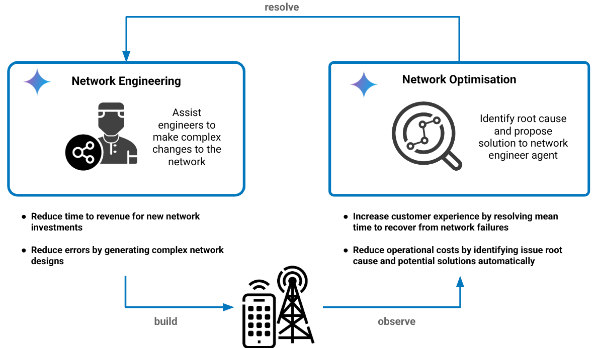
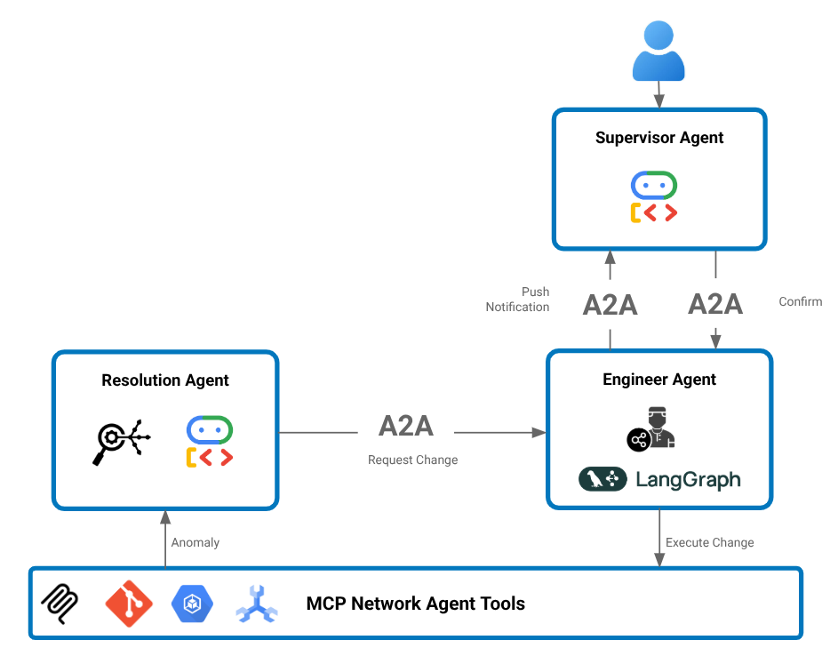

# Network Agent Demonstration

This repository demonstrates a set of network agents that manage the end to end lifecycle of a virtual telecoms network. The agents are built on [Google's Autonomous Network Operations Framework](https://cloud.google.com/blog/topics/telecommunications/the-autonomous-network-operations-framework-for-csps?e=48754805?utm_source%3Dlinkedin) and implemented using Google's [agent development kit](https://google.github.io/adk-docs/) and [agent to agent protocol](https://a2aprotocol.ai/). The agents are designed to help Network Architects and Operators easily deploy and manage complex Telco infrastructure and network function software.

## Network Agents

There are two categories of network agents provided:

* __Network Engineering Agents__: Agents that help to design and build complex network services.
* __Network Optimisation Agents__: Agents that listen to the network and suggest optimisations that can resolve an issue or improve network performance.

All agents support the Google A2A protocol, which declares each agent's capabilities and allows agents to be dynamically loaded. Adding new functionality to network lifecycle tooling as needed. 

The following agents can be found in this repository.

| Agent              | Capabilities              |
|--------------------|--------------------------|
|Supervisor Agent| Routes requests from users to the right agent to handle it|
|Engineering Agent| Decomposes network intended changes into a planned design and set of implementaion tasks |
|Operations Agent| Query the current state of the network and available network services |
|Test Agent| Run tests across the network |
|Logs Agent| Query automation and network function logs |
|Resolver Agent| Investigates incidents and attempts to auto-resolve by interacting with other agents |

These agents can interact with each other over A2A or directly with end users using natural language as described in the following sections. 

### Chat based interaction

End users interact with the supervisor agent in natural language. The supervisor agent is responsible for routing tasks to agents it knows about that can handle those tasks and report progress back to the user throughout the lifecycle of that task. 

Supervisor agent communicates to the specialist network agents over the A2A protocol. As seen in the figure above, some agents are implemented using ADK and some using Langgraph. This demonstrates agents can interact with each other dynamically irrespective of the agent framework used.

Each agent has access to a set of network automation and data tools through an MCP server. Allowing each agent to find information about the network to do their job and also request changes of the network. 

### Background network agents

The previous interaction pattern was human driven. In this pattern an agent is listening to the network and when it identifies a potential issue, it triggers a task to try to auto resolve the issue. 

When a resolution to the issue is identifed, the resolution agent interacts with other agents through the A2A protocol to make the appropriate changes to the network. In this case the engineering agent receives a request to make changes from the resolution agent. The engineering agent needs approval to make any changes, so it triggers a notification to the supervisor agent asking for approval. 

## Network Agent Architecture

The tools available to the network agents provide access to GCP network automation and topology services. Allowing agents to update the network, discover existing topology and what network services and capabilities can be deployed in the future.  

The GCP services used are: 

* __Network Orchestration__: GitOps style Kubernetes orchestration of cloud infrastructure and virtual network function resources.
* __Active Topology__: Spanner Graph model of the network topology is maintained automatically by listening to all changes made in the orchestration tools. All logs, performance metrics are captured in the same topology database. Along with embeddings of all logs and configuration of the network to allow semantic search. 
* __Virtual Mobile Network__: A set of virtual radio simulators, open source 5G core and transport network functions are deployed on GCP, provide a lab environment that can demonstrate real use case scenarios. 

## Network Agent Environment

More details on the network agents, services and the environment can be found below. 

* [Network Services](docs/networkservices.md)
* [GCP Environment](docs/gcp.md)
* [CICD](docs/cicd.md)
* [Network Agents](docs/agent.md)

## Run the demo

* [Setup GCP environment](INSTALL.md)
* [Build a 5G Network demo scenario](/docs/5gbuilddemo.md)
* [Closed Loop demo scenario](/docs/closedloopdemo.md)

## LICENSES

The source code of this project is provided under the [Apache 2.0 license](LICENSE). All other artifacts such as images, video, audio and data as free/open material is provided under the [CC-BY 4.0 license](http://creativecommons.org/licenses/by/4.0/).