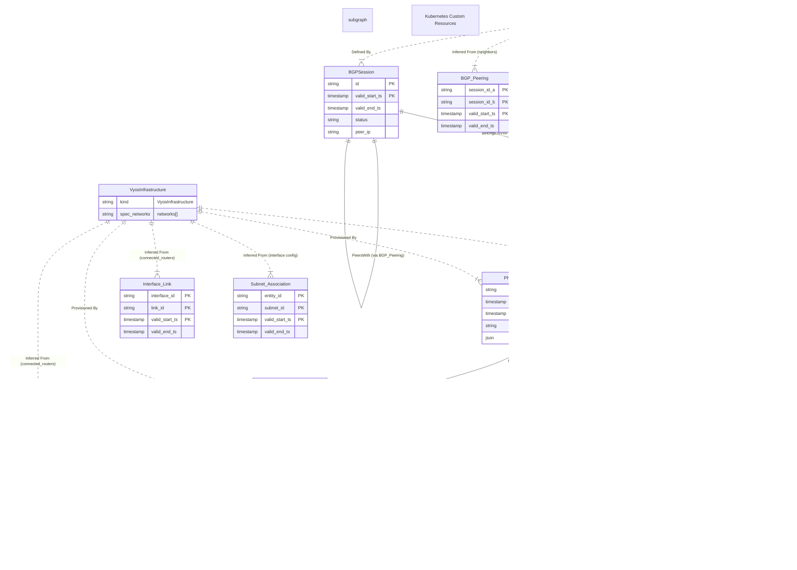

```mermaid
erDiagram
    PhysicalRouter ||--|{ PhysicalInterface : "HasInterface"
    PhysicalInterface ||--|{ PhysicalLink : "ConnectsTo"
    PhysicalLink ||--|{ PhysicalInterface : "LinkedTo"
    
    L3VPNService ||--|| Customer : "OwnedBy"
    VRF ||--|| L3VPNService : "RealizesVPN"
    VRF ||--|| PhysicalRouter : "LocatedOn"
    BGPSession ||--|| VRF : "BelongsToVRF"
    BGPSession ||--|| BGPSession : "PeersWith (via BGP_Peering)"
    
    PhysicalInterface ||--o| LogicalSubnet : "AssociatedWith"
    
    Customer ||--o{ Orders : "PlacedBy"
    L3VPNService ||--o{ ServicePerformance : "ExhibitsPerformance"
    PhysicalInterface ||--o{ NetworkMetrics : "HasMetrics"

    PhysicalRouter {
        string id PK
        timestamp valid_start_ts PK
        timestamp valid_end_ts
        string status
        json config
    }
    PhysicalInterface {
        string id PK
        timestamp valid_start_ts PK
        timestamp valid_end_ts
        string status
        string speed
        string ip_address
    }
    PhysicalLink {
        string id PK
        timestamp valid_start_ts PK
        timestamp valid_end_ts
        string status
        string bandwidth
    }
    L3VPNService {
        string id PK
        timestamp valid_start_ts PK
        timestamp valid_end_ts
        string status
        string service_type
    }
    VRF {
        string id PK
        timestamp valid_start_ts PK
        timestamp valid_end_ts
        string status
        string rd
    }
    BGPSession {
        string id PK
        timestamp valid_start_ts PK
        timestamp valid_end_ts
        string status
        string peer_ip
    }
    LogicalSubnet {
        string id PK
        timestamp valid_start_ts PK
        timestamp valid_end_ts
        string cidr
        string network_type
    }
    Customer {
        string id PK
        string name
        string type
    }
    
    %% Kubernetes Custom Resources
    subgraph K8s_CRs ["Kubernetes Custom Resources"]
        direction TB
        VyosInfrastructure {
            string kind "VyosInfrastructure"
            string spec_networks "networks[]"
        }
        VyosL3VPN {
            string kind "VyosL3VPN"
            string spec_services "services[]"
        }
    end

    %% CR to Spanner Mappings
    VyosInfrastructure ||..|{ PhysicalRouter : "Provisioned By"
    VyosInfrastructure ||..|{ PhysicalInterface : "Provisioned By"
    VyosInfrastructure ||..|{ PhysicalLink : "Inferred From (connected_routers)"
    VyosInfrastructure ||..|{ Interface_Link : "Inferred From (connected_routers)"
    VyosInfrastructure ||..|{ LogicalSubnet : "Defined By"
    VyosInfrastructure ||..|{ Subnet_Association : "Inferred From (interface config)"

    VyosL3VPN ||..|{ L3VPNService : "Defined By"
    VyosL3VPN ||..|{ VRF : "Defined By"
    VyosL3VPN ||..|{ BGPSession : "Defined By"
    VyosL3VPN ||..|{ BGP_Peering : "Inferred From (neighbors)"
    VyosL3VPN ||..|{ Customer : "Linked To (Metadata)"

    %% Edge Tables (Temporal)
    Interface_Link {
        string interface_id PK
        string link_id PK
        timestamp valid_start_ts PK
        timestamp valid_end_ts
    }
    BGP_Peering {
        string session_id_a PK
        string session_id_b PK
        timestamp valid_start_ts PK
        timestamp valid_end_ts
    }
    Subnet_Association {
        string entity_id PK
        string subnet_id PK
        timestamp valid_start_ts PK
        timestamp valid_end_ts
    }
```
